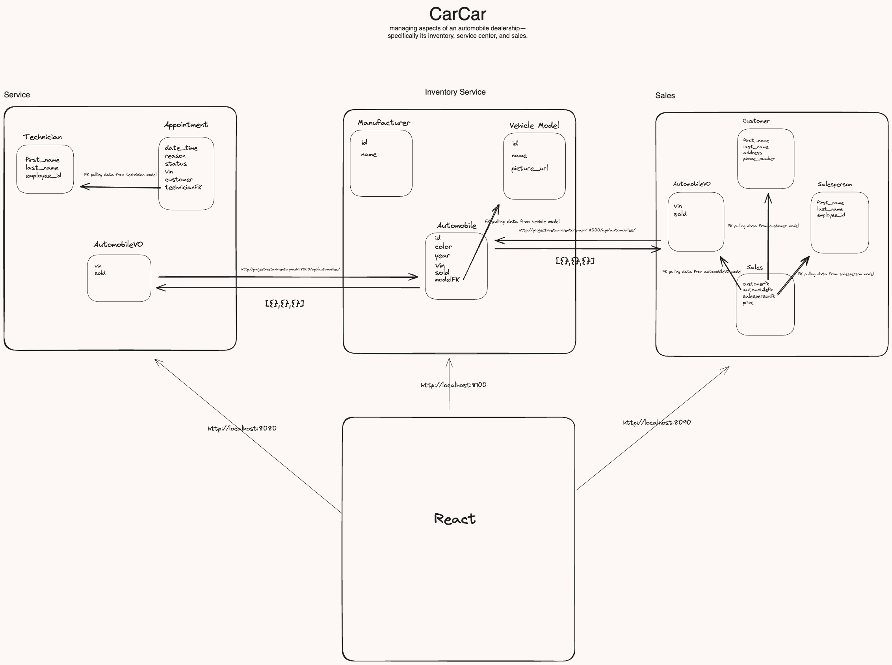

# CarCar

An application that handles the inventory, automobiles sales, and services.

Team:

* Jen Dunsmore - Sales
* Christian Culajay - Services

## Getting Started

## How to Get Started

1. Fork this repository

2. Clone the forked repository onto your local computer:
git clone <<https://gitlab.com/culajay.christian/project-beta>>

3. Build and run the project using Docker with these commands:
```
docker volume create beta-data
docker-compose build
docker-compose up
```
- After running these commands, make sure all of your Docker containers are running

- View the project in the browser: http://localhost:3000/

## Design

CarCar has 3 microservices that interact with one another.

- Inventory
- Services
- Sales

## Diagram



## Integration

The Inventory and Sales domains work with the Service domain to make everything work together.

The Inventory domain holds the records of our automobiles. The sales and service microservices get information from the Inventory domain, using a poller. It talks to the Inventory domain to keep track of what vehicles are in our invetory so that sales and services have correct informations at all times.

## Accessing Endpoints to send and view data: Through Insomnia and your browser

### Manufacturers

 List manufacturers | GET | http://localhost:8100/api/manufacturers/
 Create a manufacturer | POST | http://localhost:8100/api/manufacturers/ |
 Get a specific manufacturer | GET | http://localhost:8100/api/manufacturers/id/
 Update a specific manufacturer | PUT | http://localhost:8100/api/manufacturers/id/
 Delete a specific manufacturer | DELETE | http://localhost:8100/api/manufacturers/id/

 JSON body to send data:

Create and Update a manufacturer (SEND THIS JSON BODY):
- You cannot make two manufacturers with the same name
```
{
  "name": "Chrysler"
}
```
The return value of creating, viewing, updating a single manufacturer:
```
{
	"href": "/api/manufacturers/2/",
	"id": 2,
	"name": "Chrysler"
}
```
Getting a list of manufacturers return value:
```
{
  "manufacturers": [
    {
      "href": "/api/manufacturers/1/",
      "id": 1,
      "name": "Daimler-Chrysler"
    }
  ]
}
```

### Vehicle Models:

| Action | Method | URL
| ----------- | ----------- | ----------- |
| List vehicle models | GET | http://localhost:8100/api/models/
| Create a vehicle model | POST | http://localhost:8100/api/models/
| Get a specific vehicle model | GET | http://localhost:8100/api/models/id/
| Update a specific vehicle model | PUT | http://localhost:8100/api/models/id/
| Delete a specific vehicle model | DELETE | http://localhost:8100/api/models/id/

Create and update a vehicle model (SEND THIS JSON BODY):
```
{
  "name": "Sebring",
  "picture_url": "image.yourpictureurl.com"
  "manufacturer_id": 1
}
```

Updating a vehicle model can take the name and/or picture URL:
```
{
  "name": "Sebring",
  "picture_url": "image.yourpictureurl.com"
}
```
Return value of creating or updating a vehicle model:
- This returns the manufacturer's information as well
```
{
  "href": "/api/models/1/",
  "id": 1,
  "name": "Sebring",
  "picture_url": "image.yourpictureurl.com",
  "manufacturer": {
    "href": "/api/manufacturers/1/",
    "id": 1,
    "name": "Daimler-Chrysler"
  }
}
```
Getting a List of Vehicle Models Return Value:
```
{
  "models": [
    {
      "href": "/api/models/1/",
      "id": 1,
      "name": "Sebring",
      "picture_url": "image.yourpictureurl.com",
      "manufacturer": {
        "href": "/api/manufacturers/1/",
        "id": 1,
        "name": "Daimler-Chrysler"
      }
    }
  ]
}

### Automobiles:
- The **'vin'** at the end of the detail urls represents the VIN for the specific automobile you want to access. This is not an integer ID. This is a string value so you can use numbers and/or letters.

| Action | Method | URL
| ----------- | ----------- | ----------- |
| List automobiles | GET | http://localhost:8100/api/automobiles/
| Create an automobile | POST | http://localhost:8100/api/automobiles/
| Get a specific automobile | GET | http://localhost:8100/api/automobiles/vin/
| Update a specific automobile | PUT | http://localhost:8100/api/automobiles/vin/
| Delete a specific automobile | DELETE | http://localhost:8100/api/automobiles/vin/


Create an automobile (SEND THIS JSON BODY):
- You cannot make two automobiles with the same vin
```
{
  "color": "red",
  "year": 2012,
  "vin": "1C3CC5FB2AN120174",
  "model_id": 1
}
```
Return Value of Creating an Automobile:
```
{
	"href": "/api/automobiles/1C3CC5FB2AN120174/",
	"id": 1,
	"color": "red",
	"year": 2012,
	"vin": "777",
	"model": {
		"href": "/api/models/1/",
		"id": 1,
		"name": "R8",
		"picture_url": "image.yourpictureurl.com",
		"manufacturer": {
			"href": "/api/manufacturers/1/",
			"id": 1,
			"name": "Audi"
		}
	}
}
```
To get the details of a specific automobile, you can query by its VIN:
example url: http://localhost:8100/api/automobiles/1C3CC5FB2AN120174/

Return Value:
```
{
  "href": "/api/automobiles/1C3CC5FB2AN120174/",
  "id": 1,
  "color": "green",
  "year": 2011,
  "vin": "1C3CC5FB2AN120174",
  "model": {
    "href": "/api/models/1/",
    "id": 1,
    "name": "Sebring",
    "picture_url": "image.yourpictureurl.com",
    "manufacturer": {
      "href": "/api/manufacturers/1/",
      "id": 1,
      "name": "Daimler-Chrysler"
    }
  }
}
```
You can update the color and/or year of an automobile (SEND THIS JSON BODY):
```
{
  "color": "red",
  "year": 2012
}
```
Getting a list of Automobile Return Value:
```
{
  "autos": [
    {
      "href": "/api/automobiles/1C3CC5FB2AN120174/",
      "id": 1,
      "color": "yellow",
      "year": 2013,
      "vin": "1C3CC5FB2AN120174",
      "model": {
        "href": "/api/models/1/",
        "id": 1,
        "name": "Sebring",
        "picture_url": "image.yourpictureurl.com",
        "manufacturer": {
          "href": "/api/manufacturers/1/",
          "id": 1,
          "name": "Daimler-Chrysler"
        }
      }
    }
  ]
}

## Service microservice

Explain your models and integration with the inventory
microservice, here.

On the backend, the shoes microservice has 3 models: AutomobileVO, Technician, and Appointment. 

The Technician model allows us to create a new Technician and reference them through their unique properties of first name, last name, or employee ID.

Appointment is the model that interacts with technician with a ForeignKey. This model gets data from Technicians.

The AutomobileVO is a value object that gets data about the automobiles in the Inventory using a poller. The poller automotically polls the Invetory microservice api for data, so the Service microservice is constantly getting the updated data.

The reason for integration between these three microservices is that when recording a new shoe, you'll need to choose which bin is being used and that information lives inside of the shoe microservice

### Technicians

| Action | Method | URL
| ----------- | ----------- | ----------- |
| List technicians | GET | http://localhost:8080/api/technicians/
| Technician detail | GET | http://localhost:8080/api/technicians/<int:pk>/
| Create a technician | POST | http://localhost:8080/api/technicians/
| Delete a technician | DELETE | http://localhost:8080/api/technicians/<int:pk>/


LIST TECHNICIANS: Following this endpoint will give you a list of all technicians that are currently employed.
Since this is a GET request, you do not need to provide any data.
```
Example:
{
	"technicians": [
		{
			"first_name": "Donald",
            "last_name": "Duck",
			"employee_id": DDuck,
			"id": 1
		},
    ]}
```

TECHNICIAN DETAIL: This is a GET request as well, so no data needs to be provided here either. When you list technicians, you will
see that they are assigned a value of "id". This is the value that will replace "<int:pk>. For example, if you wanted to see the technician
details related to our technician "Donald", you would input the following address: http://localhost:8080/api/technicians/1/
This would then lead to this:

```
{
	"first_name": "Donald",
    "last_name": "Duck",
	"employee_id": DDuck,
	"id": 1
}
```
This how our technician detail is displayed. If you want to change the technician, just change the value at the end to match the "id" of the technician you want to display.

CREATE TECHNICIAN - To create a technician, use the following format to input the data and you would just submit this as a POST request.
```
{
	"first_name": "Liz",
    "last_name": "McGuire"
	"employee_id": LMcGuire
}
```
As you can see, the data has the same format. In this example, we just changed the "name" field from "Donald" to "Liz". We also assigned her the "employee_number" value of "2" instead of "1".
Once we have the data into your request, we just hit "Send" and it will create the technician "Liz". To verify that it worked, just select follow the "LIST TECHNICIAN" step from above to show all technicians.
With any luck, both Donald and Liz will be there.
Here is what you should see if you select "LIST TECHNICIAN" after you "CREATE TECHNICIAN" with Liz added in:
```
{
	"technicians": [
		{
			"first_name": "Donald",
            "last_name": "Duck",
			"employee_id": DDuck,
			"id": 1
		},
		{
            "first_name": "Liz",
            "last_name": "McGuire",
            "employee_id": LMcGuire,
            "id": 2
		},
    ]}
```

DELETE TECHNICIAN - If we need to remove the technician from the system. You just need to change the request type to "DELETE" instead of "POST". You also need to pull the "id" value just like you did in "TECHNICIAN DETAIL" to make sure you delete the correct one. Once deleted, they will no longer be in our page that lists
all technicians.


And that's it! You can view all technicians, look at the details of each technician, and create technicians.
Remember, the "id" field is AUTOMATICALLY generated by the program. So you don't have to input that information. Just follow the steps in CREATE TECHNICIAN and the "id" field will be populated for you.
If you get an error, make sure your server is running and that you are feeding it in the data that it is requesting.
If you feed in the following:
```
{
        "first_name": "Liz",
        "last_name": "McGuire",
        "employee_id": LMcGuire,
	    "favorite_food": "Tacos"
}

You will get an error because the system doesn't know what what to do with "Tacos" because we aren't ever asking for that data. We can only send in data that Json is expecting or else it will get angry at us.

```

### Service Appointments

| Action | Method | URL
| ----------- | ----------- | ----------- |
| List service appointments | GET | http://localhost:8080/api/serviceappointment/
| Service appointment history | GET | http://localhost:8080/api/servicehistory/<int:vin (OPTIONAL)>
| Create service appointment | POST | http://localhost:8080/api/serviceappointment/
| Delete service appointment | DELETE | http://localhost:8080/api/serviceappointment/<int:id>
| Cancel service appointment | PUT | http://localhost:8080/api/appointments/<int:id>/cancel/
| Finish service appointment | PUT | http://localhost:8080/api/appointments/<int:id>/finish/


LIST SERVICE APPOINTMENT: This will return a list of all current service appointment.
This is the format that will be displayed.
Remember, the way that it is returned to you is the way that the data needs to be accepted. Remember, the "id", "is_VIP" and "status" are automatically generated, so you don't need to input that.
Also, the "date_time" field HAVE TO BE IN THIS FORMAT
```
{
	"appointments": [
		{
			"id": 1,
			"vin": "1222",
			"customer": "Barry Allen",
			"date_time": "2021-07-14 12:30:00",
            "status": "created,
			"reason": "mah tires",
			"is_VIP": false,
			
            "technician": {
                            "first_name": "Liz",
                            "last_name": "McGuire",
                        }
		},
    ]}
```
```
SERVICE APPOINTMENT HISTORY: This will show the detail based on the "VIN" that is input. You will see ALL service appointments for the vehicle associated with the "vin" that you input.
Inside the search bar, input the vin associated with the vehicle that you wish to view. If you leave this field blank, it will show all service history for all vehicles.
```
{
	"service_history": [
		{
			"id": 1,
			"vin": "1222",
			"customer_name": "Barry Allen",
			"date_time": "2021-07-14 12:30:00",
            "status": "created,
			"reason": "mah tires",
			"is_VIP": "No",
			
            "technician": {
                        "first_name": "Liz",
                        "last_name": "McGuire",
                    }
		},
		{
			"id": 6,
			"vin": "1222",
			"customer_name": "Gary Allen",
			"date_time": "2021-07-14 12:30:00",
            "status": "finished,
			"reason": "new car",
			"is_VIP": "No",
			
            "technician": {
                        "first_name": "Caleb",
                        "last_name": "City",
            }
		}
	]
}
```
If we add "1222" to the request (eg. http://localhost:8080/api/servicehistory/1222), then it will show the above. If you put a vin that does not exist in the system, it will return a blank list.


CREATE SERVICE APPOINTMENT - This will create a service appointment with the data input. It must follow the format. Remember, the "id" is automatically generated, so don't fill that in. To verify
that it was added, just look at your service appointment list after creating a service appointment and it should be there.
```
		{
			"id": 6,
			"vin": "1222",
			"customer": "Gary Allen",
			"date_time": "2021-07-14 12:30:00",
            "status": "created,
			"reason": "new car",
			"is_VIP": "No",
			"technician": "Caleb"
		}

```
DELETE SERVICE APPOINTMENT - Just input the "id" of the service appointment that you want to delete at the end of the url. For example, if we wanted to delete the above service history appointment for Barry
because we accidently input his name as "Gary Allen", we would just enter 'http://localhost:8080/api/serviceappointment/6' into the field and send the request. We will receive a confirmation message saying that
the service appointment was deleted.

UPDATE APPOINTMENT - This will allow you to change the status of the service appointment to either "canceled" or "finished" with the data input after your appointment is no longer needed or completed. For conceling in Insomnia, use this url http://localhost:8080/api/appointments/<int:id>/cancel/ and for finshing use this http://localhost:8080/api/appointments/<int:id>/finish/ In the front end, we've incorporated buttons to to reflect these status changes to be more user friendly. It must follow the format, inside Insomnia only. To verfy that it has changed, look at your appointment list after updating the service appointment.

{
    "status": "canceled"
}

or:

{
    "status": "finished"
}

## Sales microservice

Explain your models and integration with the inventory
microservice, here.
